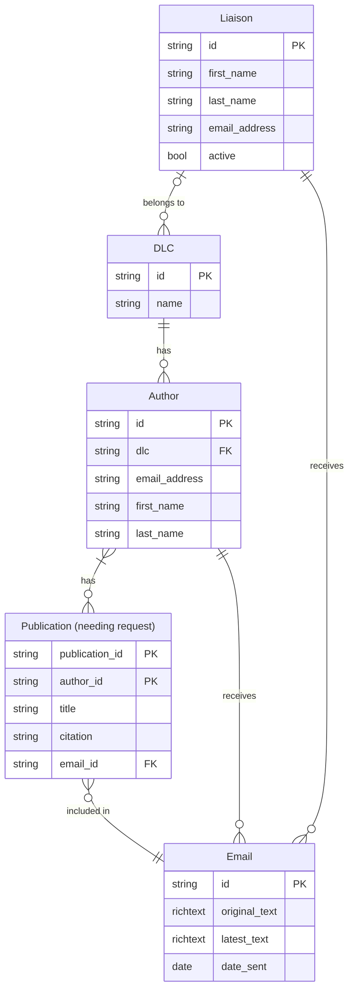

# PERS Database Entity Relationship Diagram 

The Publication Email Request Service (PERS) relies on a database to keep track of the email requests that have been sent by stakeholders. Monitoring the email requests via database prevents duplication of email requests. The diagram describes the relationships between entities, or tables, in the database.

The entities involved in PERS are as follows:

* `DLC`: Represents a department, lab, or center at MIT and is managed by a single **liaison**. A **DLC** can comprise of many **authors**, but an author is assigned to a single **DLC**.
* `Liaison`: Represents a DLS staff member on MIT's Scholarly Communications team. **Liaisons** are assigned to one or more **DLCs**. **Liaisons** receive the email requests generated by PERS, who then send the email to authors in their assigned DLCs.
* `Author`: Represents MIT student and faculty who are registered on Symplectic Elements. An **author** is assigned to a single **DLC**. When citations are imported for an author, zero or more **Publications** may be found that require submission.
* `Publications`: Represents a publication written by one or more **Authors**.
* `Email`: Represents an email request for a publication. Many **publications** may be associated with a single **email**. The email generated by PERS will contain a list of citations for publications that need submission. 

   **Note:** According to Solenoid documentation, authors on a single publication will receive **at most one (1)** email for a publication. However, (TO BE CONFIRMED) this is only if, when they're data is imported, the publication appears as not having been requested yet (via a second author that was previously imported through PERS).

