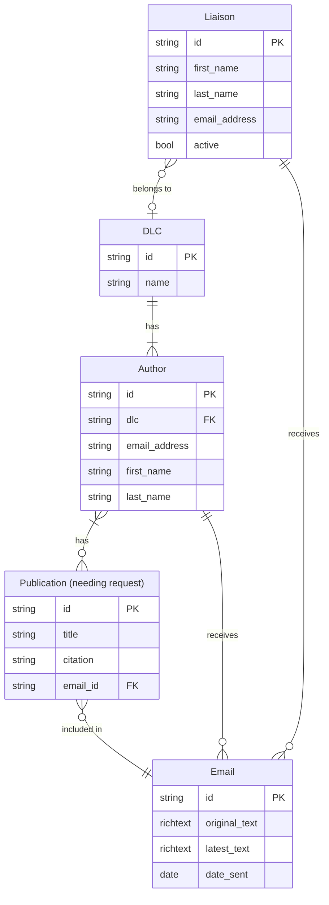

# PERS Database Entity Relationship Diagram 

The Publication Email Request Service (PERS) relies on a database to keep track of the email requests that have been sent by stakeholders. Monitoring the email requests via database prevents duplication of email requests. The diagram describes the relationships between entities, or tables, in the database.

The relationships depicted in the diagram can be summarized as follows:
* A `Liaison` belongs to **one** `DLC`.
* A `DLC` is assigned to **one or more** authors.
* A `Publication (needing request)` can be associated with **one or more** `Author(s)`.
* A `Publication (needing request)` can only be included in **one** `Email`; an `Email` can include **one or more** `Publication(s)`.
* When an `Email` is created, it is assigned to **one** `Author` and **one** `Liaison`.

