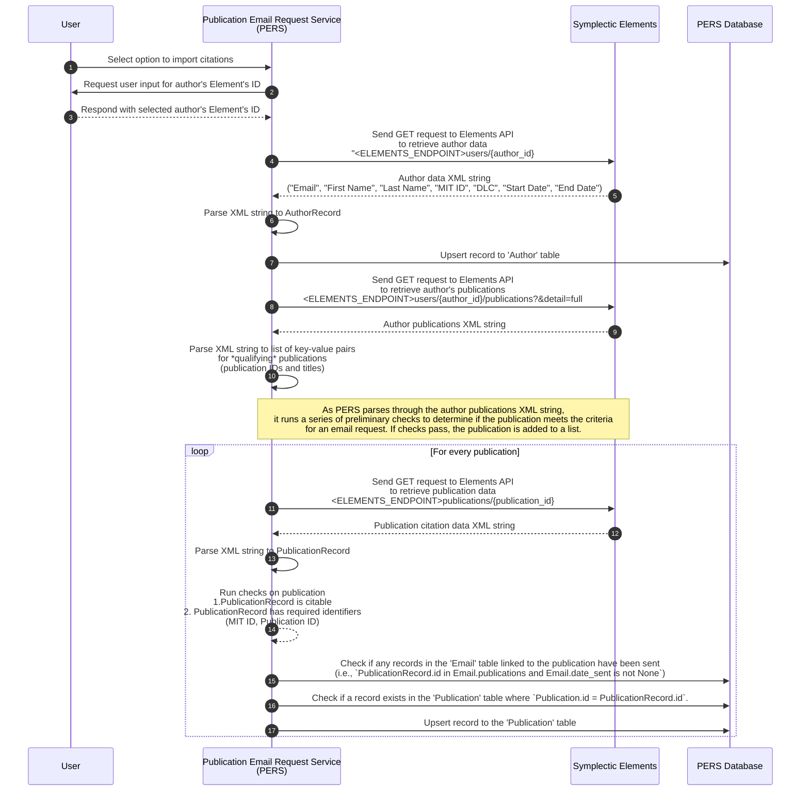
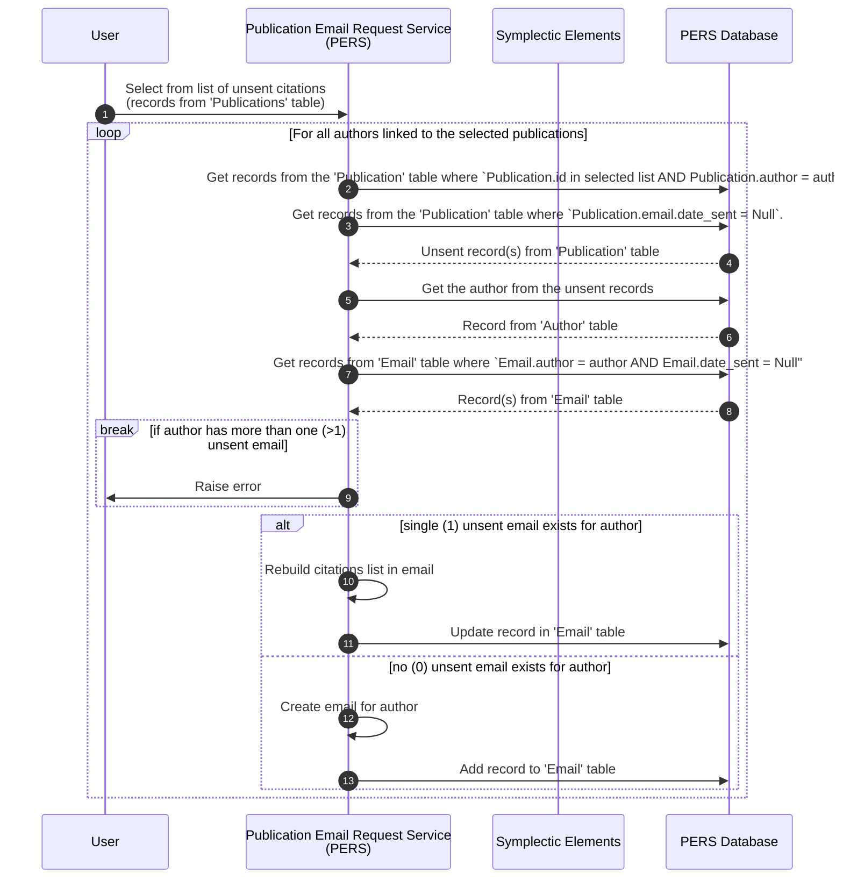
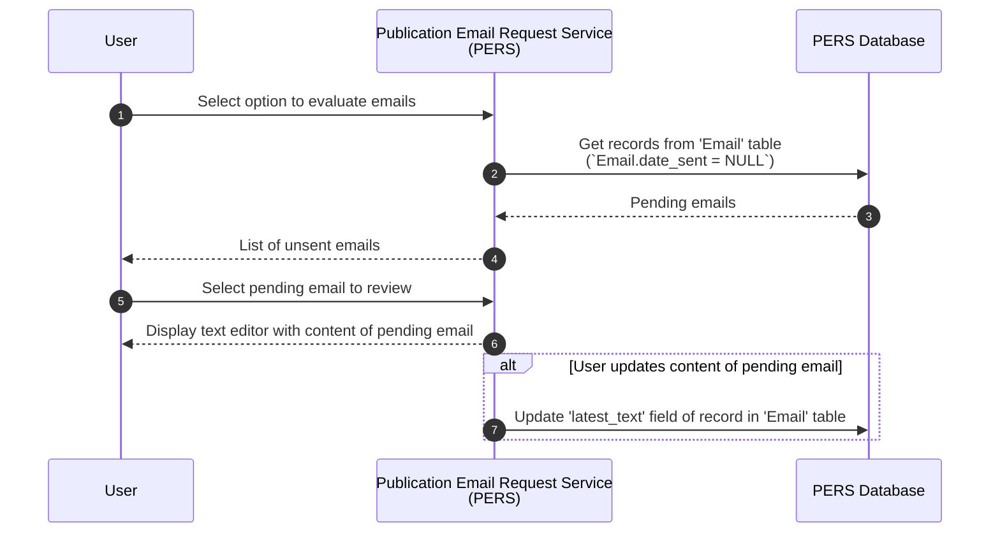
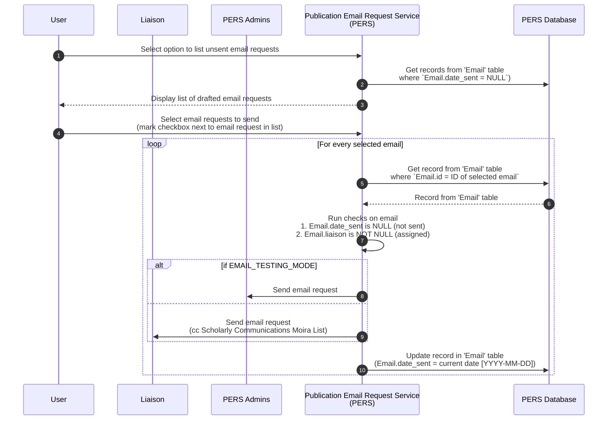

# Publication Email Request Service (PERS)

The following are sequence diagrams describing the workflow for sending publication email requests with this service. At high-level the steps involved are:

1. Import citations for authors
2. Create publication email requests
3. Review and (optionally) update emails
4. Send emails to Liaisons

## Import citations for authors 

## Create publication email requests

## Review and (optionally) update emails

## Send emails to Liaisons

